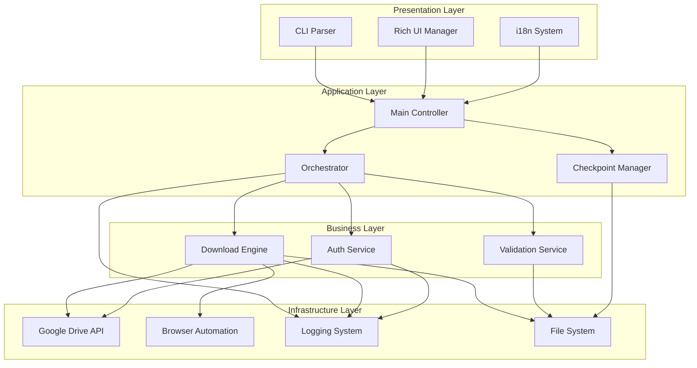
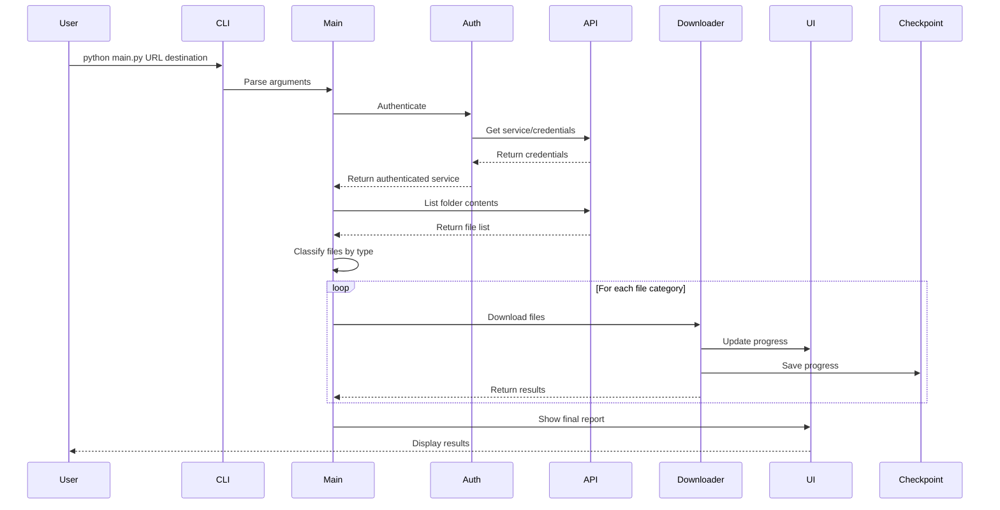
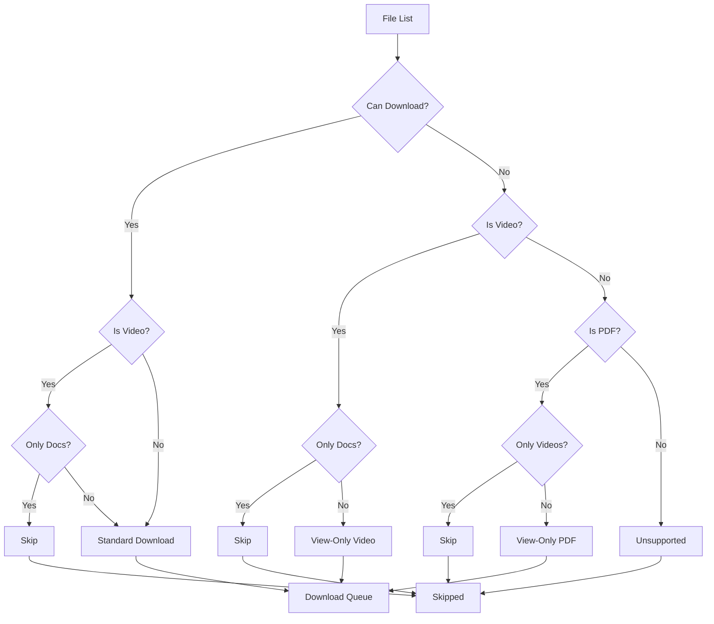

# System Architecture

High-level architecture and design patterns used in GD-Downloader.

## Table of Contents
- [Overview](#overview)
- [Architecture Patterns](#architecture-patterns)
- [Component Diagram](#component-diagram)
- [Data Flow](#data-flow)
- [Module Interactions](#module-interactions)
- [Design Decisions](#design-decisions)
- [Concurrency Model](#concurrency-model)
- [Error Handling Strategy](#error-handling-strategy)
- [Performance Considerations](#performance-considerations)

---

## Overview

GD-Downloader follows a **layered architecture** with clear separation of concerns:

```
┌─────────────────────────────────────────────────────────────┐
│                    Presentation Layer                       │
│  ┌─────────────┐ ┌─────────────┐ ┌─────────────────────────┐ │
│  │   CLI/Args  │ │ Rich UI     │ │   Internationalization   │ │
│  │   Parser    │ │   Manager   │ │      System (i18n)      │ │
│  └─────────────┘ └─────────────┘ └─────────────────────────┘ │
└─────────────────────────────────────────────────────────────┘
                              │
┌─────────────────────────────────────────────────────────────┐
│                    Application Layer                        │
│  ┌─────────────┐ ┌─────────────┐ ┌─────────────────────────┐ │
│  │  Main       │ │  Orchest-   │ │     Checkpoint          │ │
│  │  Controller │ │  ration     │ │     System              │ │
│  └─────────────┘ └─────────────┘ └─────────────────────────┘ │
└─────────────────────────────────────────────────────────────┘
                              │
┌─────────────────────────────────────────────────────────────┐
│                     Business Layer                         │
│  ┌─────────────┐ ┌─────────────┐ ┌─────────────────────────┐ │
│  │  Download   │ │  Auth       │ │     Validation          │ │
│  │  Engine     │ │  Service    │ │     Service             │ │
│  └─────────────┘ └─────────────┘ └─────────────────────────┘ │
└─────────────────────────────────────────────────────────────┘
                              │
┌─────────────────────────────────────────────────────────────┐
│                  Infrastructure Layer                       │
│  ┌─────────────┐ ┌─────────────┐ ┌─────────────────────────┐ │
│  │   Google    │ │   Browser   │ │      Logging            │ │
│  │   Drive API │ │ Automation  │ │      System             │ │
│  └─────────────┘ └─────────────┘ └─────────────────────────┘ │
└─────────────────────────────────────────────────────────────┘
```

### Core Principles

1. **Single Responsibility**: Each module has a focused purpose
2. **Dependency Injection**: Services are injected rather than hard-coded
3. **Async/Await**: Non-blocking operations where possible
4. **Thread Safety**: Critical sections are protected with locks
5. **Fail-Fast**: Errors are caught early and handled explicitly

---

## Architecture Patterns

### 1. Layered Architecture
Clear separation between presentation, application, business, and infrastructure layers.

### 2. Repository Pattern
Checkpoint system implements repository pattern for persistence.

### 3. Strategy Pattern
Different download strategies for different file types:
- Standard downloads (API-based)
- View-only videos (Browser automation)
- View-only PDFs (Screen capture + OCR)

### 4. Observer Pattern
Progress callbacks update UI components.

### 5. Factory Pattern
Service objects are created by factory functions.

### 6. Command Pattern
CLI arguments are converted to command objects.

---

## Component Diagram



---

## Data Flow

### Download Flow



### File Classification Flow



---

## Module Interactions

### Main Controller (main.py)
**Responsibilities:**
- Parse and validate CLI arguments
- Initialize all subsystems
- Orchestrate download process
- Handle interrupts gracefully

**Key Interactions:**
```python
# Authentication flow
service, creds = get_drive_service()

# File discovery
traverse_and_prepare_download_batch(service, folder_id, path, queue)

# Classification
parallel_tasks, video_tasks, pdf_tasks, unsupported = classify_files(
    queue, completed, filters
)

# Parallel execution
with ThreadPoolExecutor(max_workers=workers) as executor:
    futures = [executor.submit(worker, task) for task in tasks]
```

### Download Engine (downloader.py)
**Responsibilities:**
- Execute different download strategies
- Handle retries and error recovery
- Provide progress feedback
- Manage browser automation

**Strategy Pattern Implementation:**
```python
def download_file(file_info, strategy='standard'):
    if strategy == 'standard':
        return download_standard_file(...)
    elif strategy == 'view_only_video':
        return download_view_only_video(...)
    elif strategy == 'view_only_pdf':
        return download_view_only_pdf(...)
```

### Authentication Service (auth_drive.py)
**Responsibilities:**
- OAuth2 flow management
- Token refresh
- Service object creation
- Credential validation

**Token Management:**
```python
class TokenManager:
    def load_token(self) -> Optional[Credentials]:
        # Load from token.json
        
    def refresh_token(self, creds: Credentials) -> Credentials:
        # Refresh if expired
        
    def save_token(self, creds: Credentials) -> None:
        # Save to token.json
```

---

## Design Decisions

### 1. Multi-Strategy Download Architecture
**Problem:** Different file types require different download methods
**Solution:** Strategy pattern with pluggable download strategies

### 2. Thread Pool Executor
**Problem:** Need efficient parallel processing
**Solution:** ThreadPoolExecutor with configurable worker count
**Benefits:** Simple thread management, built-in future handling

### 3. Producer-Consumer Pattern
**Problem:** Need efficient task distribution to workers
**Solution:** Queue-based producer-consumer with atomic operations

### 4. Atomic Checkpoint System
**Problem:** Corruption risk with concurrent checkpoint writes
**Solution:** Atomic file writes with temporary files

### 5. Rich-First UI Design
**Problem:** Need informative console interface
**Solution:** Rich library for all UI components

### 6. Configuration-Driven Design
**Problem:** Many configurable parameters
**Solution:** Centralized config module with environment override support

---

## Concurrency Model

### Thread Pool Architecture
```python
# Main thread (orchestration)
main_thread:
    └── ThreadPoolExecutor(workers=N)
        ├── Worker 1
        ├── Worker 2
        ├── ...
        └── Worker N

# Each worker handles:
# - API requests
# - File downloads
# - Progress updates
# - Checkpoint updates
```

### Synchronization Points

1. **Progress Updates**: Thread-safe Rich progress bars
2. **Checkpoint Writes**: Atomic file operations with locks
3. **Completed Sets**: Thread-safe Set operations
4. **Global State**: Atomic flags for interruption handling

### Producer-Consumer Implementation
```python
class TaskDistributor:
    def __init__(self, max_workers: int):
        self.available_workers = Queue(maxsize=max_workers)
        self.pending_tasks = Queue()
        self.active_futures = {}
        self.submit_lock = threading.Lock()
    
    def submit_next_task(self) -> bool:
        """Thread-safe task submission"""
        with self.submit_lock:
            if self.pending_tasks.empty() or self.available_workers.empty():
                return False
            
            worker_id = self.available_workers.get()
            task = self.pending_tasks.get()
            future = executor.submit(worker, task)
            self.active_futures[future] = (task, worker_id)
            return True
```

---

## Error Handling Strategy

### Exception Hierarchy
```
GDDownloaderError (base)
├── AuthenticationError
├── InvalidURLError
├── ValidationError
├── FFmpegNotFoundError
├── DownloadError
│   ├── NetworkError
│   ├── PermissionError
│   └── FileCorruptionError
├── BrowserAutomationError
└── OCRError
```

### Error Handling Patterns

#### 1. Graceful Degradation
```python
def download_with_fallback(file_info):
    try:
        return download_standard_file(file_info)
    except DownloadError:
        try:
            return download_view_only_video(file_info)
        except BrowserAutomationError:
            log_error("All download methods failed")
            return False
```

#### 2. Retry with Backoff
```python
def with_retry(func, max_attempts=3, delay=2):
    for attempt in range(max_attempts):
        try:
            return func()
        except Exception as e:
            if attempt == max_attempts - 1:
                raise
            time.sleep(delay * (2 ** attempt))  # Exponential backoff
```

#### 3. Contextual Error Information
```python
class ValidationError(GDDownloaderError):
    def __init__(self, message: str, field: str = None, value: str = None):
        context = []
        if field:
            context.append(f"Field: {field}")
        if value:
            context.append(f"Value: {value}")
        
        details = "; ".join(context) if context else None
        super().__init__(message, details)
```

---

## Performance Considerations

### Memory Management

#### 1. Streaming Downloads
```python
def download_standard_file(service, file_id, save_path):
    request = service.files().get_media(fileId=file_id)
    
    with MediaIoBaseDownload(request, fh, chunksize=CHUNK_SIZE) as downloader:
        while downloader.next_chunk() is not None:
            # Process chunk without loading entire file in memory
            pass
```

#### 2. Controlled Parallelism
```python
# Limit concurrent operations based on content type
max_workers = min(
    requested_workers,
    cpu_count(),
    20,  # Hard limit for API rate limits
    len(tasks)  # Don't create more workers than tasks
)
```

### I/O Optimization

#### 1. Batch API Requests
```python
# Process multiple folders in batch
batch = service.new_batch_http_request()
for folder in folders[:100]:  # Batch limit
    request = service.files().list(q=f"'{folder['id']}' in parents")
    batch.add(request, callback=callback)
batch.execute()
```

#### 2. Connection Pooling
```python
# Reuse HTTP connections
from googleapiclient.discovery import build

service = build('drive', 'v3', credentials=creds, 
               cache_discovery=False)  # Disable cache for performance
```

### CPU Optimization

#### 1. Selective OCR
```python
# OCR is CPU-intensive - make it optional
if ocr_enabled:
    # Use single worker for OCR to limit CPU usage
    with ThreadPoolExecutor(max_workers=1) as executor:
        future = executor.submit(process_pdf_with_ocr, pdf_path)
```

#### 2. GPU Acceleration
```python
# Offload video processing to GPU when available
if gpu_type == 'nvidia':
    video_processor = GPUVideoProcessor(device='cuda')
elif gpu_type == 'intel':
    video_processor = GPUVideoProcessor(device='intel')
else:
    video_processor = CPUVideoProcessor()
```

---

## Extensibility Points

### 1. Plugin Architecture
```python
class DownloadPlugin:
    def can_handle(self, file_info: Dict) -> bool:
        """Return True if plugin can handle this file type"""
        
    def download(self, file_info: Dict, destination: str) -> bool:
        """Download the file"""

# Register plugins
plugin_manager.register(VideoDownloadPlugin())
plugin_manager.register(PDFDownloadPlugin())
```

### 2. Custom Validators
```python
class Validator:
    def validate(self, value: any) -> Tuple[bool, Optional[str]]:
        """Return (is_valid, error_message)"""

validator_manager.register('url', URLValidator())
validator_manager.register('path', PathValidator())
```

### 3. Configurable Strategies
```python
# Strategy can be configured per file type
download_strategies = {
    'video': 'gpu_accelerated',  # or 'standard' or 'cpu_only'
    'pdf': 'ocr_enabled',        # or 'raw'
    'document': 'fast_export',   # or 'high_quality'
}
```

---

## Security Considerations

### 1. Credential Protection
```python
# Store credentials with restricted permissions
os.chmod('credentials.json', 0o600)
os.chmod('token.json', 0o600)

# Clear sensitive data from logs
def sanitize_for_logging(data):
    if 'access_token' in data:
        data['access_token'] = '[REDACTED]'
    return data
```

### 2. Path Validation
```python
def validate_path_safe(path: str, allowed_base: Path) -> Path:
    """Prevent directory traversal attacks"""
    resolved = Path(path).resolve()
    if not str(resolved).startswith(str(allowed_base.resolve())):
        raise ValidationError("Path traversal detected")
    return resolved
```

### 3. Rate Limiting
```python
class RateLimiter:
    def __init__(self, requests_per_second: float):
        self.min_interval = 1.0 / requests_per_second
        self.last_request = 0
    
    def wait(self):
        elapsed = time.time() - self.last_request
        if elapsed < self.min_interval:
            time.sleep(self.min_interval - elapsed)
        self.last_request = time.time()
```

---

This architecture enables GD-Downloader to handle diverse download scenarios efficiently while maintaining code quality, extensibility, and robustness.

---

**Last updated: 2025-10-07**